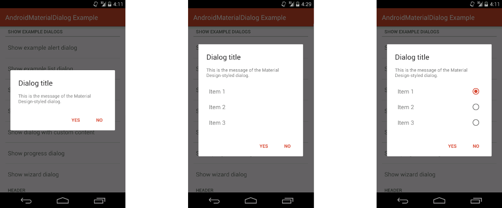

# AndroidMaterialDialog - README

"AndroidMaterialDialog" is an Android-library, which provides a builder, which allows to create dialogs, which are designed according to Android 5's Material Design guidelines even on pre-Lollipop devices.



The library provides the following features:

- The builder has been designed to be similar to the Android SDK's built-in class `android.app.AlertDialog.Builder` and therefore provides all of its functionalities, including the possibilities to create dialogs with a title, icon, message, up to three buttons and optional list items.
- The library uses the AppCompat v7 support library in order to retrieve the color of a dialog's button texts from the applied theme. Alternatively, these colors can be set manually using the builder.
- A dialog's title and content can be replaced by any custom view.
- The builder supports to create dialogs, whose buttons are stacked, as introduced in the Material Design guidelines.

## License Agreement

This project is distributed under the GNU Lesser Public License version 3.0 (GLPLv3). For further information about this license agreement's content please refer to its full version, which is available at http://www.gnu.org/licenses/lgpl.txt.

## Download

The latest release of this library can be downloaded as a zip archive from the download section of the project's Github page, which is available [here](https://github.com/michael-rapp/AndroidMaterialDialog/releases). Furthermore, the library's source code is available as a Git repository, which can be cloned using the URL https://github.com/michael-rapp/AndroidMaterialDialog.git.

Alternatively, the library can be added to your Android app as a Gradle dependency by adding the following to the respective module's `build.gradle` file:

```groovy
dependencies {
    compile 'com.github.michael-rapp:android-material-dialog:3.1.1'
}
```

Before version 2.0.0 this project was hosted on [Sourceforge](https://sourceforge.net/projects/androidmaterialdialog). These older versions used the legacy Eclipse ADT folder structure and are not available as Gradle artifacts.

## Examples

The code below shows how to create and show an alert dialog by using the library's `MaterialDialog.Builder`. The dialog contains a title and message and can be closed by the user by either using a "OK" button or a "Cancel" button. The `this` parameter, which is passed to the builder's constructor in the example below, must be a `Context`, e.g. an `Activity`. The `null` parameters, which are passed to the `setPositiveButton`- and `setNegativeButton`-methods can be replaced by instances of the type `DialogInterface.OnClickListener` in order to execute some code when the user closes the dialog by clicking the corresponding button.

```java
MaterialDialog.Builder dialogBuilder = new MaterialDialog.Builder(this); 
dialogBuilder.setTitle(R.string.dialog_title); 
dialogBuilder.setMessage(R.string.dialog_message); 
dialogBuilder.setTitle(R.string.dialog_title); 
dialogBuilder.setPositiveButton(android.R.string.ok, null); 
dialogBuilder.setNegativeButton(android.R.string.cancel, null); 
MaterialDialog dialog = dialogBuilder.create();
dialog.show();
```

As the methods of the class `MaterialDialog.Builder`, which is provided by this library, are nearly identical to the API of the Android SDK's class [`AlertDialog.Builder`](http://developer.android.com/reference/android/app/AlertDialog.Builder.html), the practices, which are described in [this](http://developer.android.com/guide/topics/ui/dialogs.html#AlertDialog) section of the Android developer guide, do also work together with this library.

## Contact information

For personal feedback or questions feel free to contact me via the mail address, which is mentioned on my [Github profile](https://github.com/michael-rapp). If you have found any bugs or want to post a feature request please use the [bugtracker](https://github.com/michael-rapp/AndroidMaterialViews/issues) to report them.